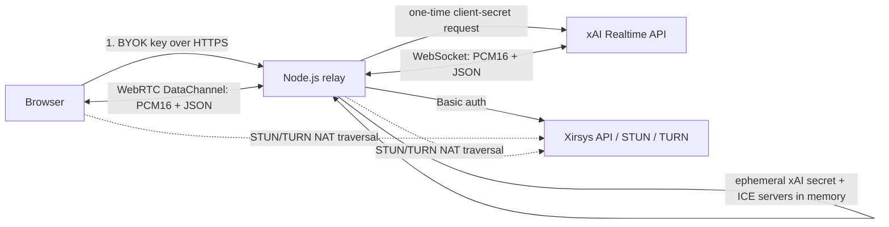

# Grok Voice Think Fast 2.0 with WebRTC and Xirsys

A TypeScript/Node.js relay and plain browser demo for a live speech-to-speech
Grok agent. The browser talks WebRTC to Node. Xirsys supplies short-lived
STUN/TURN credentials for that ICE connection. Node passes the same 24 kHz
PCM16 audio and Realtime events to xAI over WebSocket.

This is a learning implementation, not a production-ready voice platform.

- Public repository: [github.com/xirsys/grok-voice-think-fast-2-xirsys](https://github.com/xirsys/grok-voice-think-fast-2-xirsys)
- Live demo: [demo.xirsys.com/grok-voice-think-fast-2-xirsys](https://demo.xirsys.com/grok-voice-think-fast-2-xirsys/)

## What goes over which transport?



| Concern | Transport | Provider |
| --- | --- | --- |
| Microphone input and Grok audio | WebRTC DataChannel, PCM16 | Browser ↔ Node |
| Browser/relay NAT traversal | ICE with STUN/TURN | Xirsys |
| Realtime audio and events | Secure WebSocket | Node ↔ xAI |
| Tester xAI key | One HTTPS bootstrap request | Demo server |
| Long-lived Xirsys credentials | Server environment only | Node |

The Xirsys service does **not** carry the Node-to-xAI WebSocket. TURN is a
fallback for the browser-to-relay WebRTC connection and becomes the media path
only when ICE selects a `relay` candidate. This fallback is important because
a direct WebRTC path that works on a permissive home network may be blocked by
enterprise firewalls, carrier NAT, hotel Wi-Fi, or other restrictive networks.
Without a reachable TURN service, the voice session can fail even though the
browser and application code are otherwise working correctly.

## Scope

This tutorial demonstrates:

- the pinned `grok-voice-think-fast-2.0` speech-to-speech model;
- a browser WebRTC peer connected to a pure JavaScript `werift` peer on Node;
- ordered PCM16 audio and Realtime JSON events over a WebRTC data channel;
- a server-side xAI WebSocket authenticated with a short-lived client secret;
- fresh, end-user geo-routed Xirsys ICE credentials for every session;
- selected ICE-path diagnostics and a real relay-only test; and
- a secure, path-prefix-safe demo deployment behind Caddy.

It does not implement user accounts, billing controls, tool calls, durable
conversation history, session resumption, horizontal session coordination, or
abuse-resistant public access. Add those before using the pattern in a real
product.

## Prerequisites

- Node.js 20 or newer
- an xAI API key with Speech to Speech access
- a Xirsys account and an existing channel
- Chrome, Edge, Firefox, or Safari with WebRTC and microphone support
- `localhost` for development or HTTPS in production

## 1. Get the source

```bash
git clone https://github.com/xirsys/grok-voice-think-fast-2-xirsys.git
cd grok-voice-think-fast-2-xirsys
npm install
cp .env.example .env
```

Set the required Xirsys values in `.env`:

```dotenv
XIRSYS_IDENT=your-xirsys-ident
XIRSYS_SECRET=your-xirsys-secret
XIRSYS_CHANNEL=your-channel-name
```

When deploying directly behind one trusted reverse proxy, also set
`TRUST_PROXY=true`. The server then uses Express's proxy-derived client address
for Xirsys geo routing and rate limiting. Leave it disabled when clients can
connect to Node directly.

The demo pins the model for stable behavior:

```dotenv
XAI_MODEL=grok-voice-think-fast-2.0
XAI_VOICE=eve
XAI_INSTRUCTIONS=You are a concise, curious voice assistant. Speak naturally and keep answers brief.
```

The public demo intentionally leaves `XAI_API_KEY` empty. Each tester enters a
key into the page. The server uses it once to request a short-lived xAI
Realtime client secret, keeps only that ephemeral value for the pending
session, and never writes either value to disk, logs, cookies, browser storage,
or the URL.

This bring-your-own-key flow is a demo-specific trust tradeoff: a tester must
trust the page and server during the exchange. Use a temporary or restricted
project key and revoke it after testing. A private deployment may set
`XAI_API_KEY` on the server and hide the browser key field, but it then pays for
and must authorize every session.

## 2. Run the voice agent

```bash
npm run dev
```

Open [http://localhost:3002](http://localhost:3002), enter an xAI key, select
**Connect microphone**, grant permission, and speak. Server VAD ends each turn
automatically. The page also supports text turns over the same data channel.

The connection happens in this order:

1. The browser asks for microphone permission.
2. `POST /api/bootstrap` uses the tester key once to mint a short-lived xAI
   secret and requests Xirsys ICE servers with `webrtc=1` and `expire=60`.
   When Express provides a valid public client address through the trusted
   proxy, the request also includes `geo=1` and `{"user_ip":"…"}`.
3. The server stores only the ephemeral xAI secret and Xirsys ICE response under
   a random, single-use signaling ID for up to two minutes.
4. The browser and `werift` create peer connections using the same Xirsys ICE
   configuration and exchange SDP/candidates over the demo's signaling socket.
5. Node opens `wss://api.x.ai/v1/realtime?model=grok-voice-think-fast-2.0`
   with the ephemeral client-secret protocol.
6. The browser captures 24 kHz mono PCM16. Audio and Realtime JSON events cross
   the WebRTC data channel unchanged, then cross the xAI WebSocket unchanged.

## 3. Use the server clients

### Request short-lived Xirsys ICE servers

```ts
import { XirsysClient } from "./src/sdk/index.js";

const xirsys = new XirsysClient({
  ident: process.env.XIRSYS_IDENT!,
  secret: process.env.XIRSYS_SECRET!,
  channel: process.env.XIRSYS_CHANNEL!,
});

const iceServers = await xirsys.getIceServers({
  expiresInSeconds: 60,
  userIp: request.ip, // derived from the trusted request/proxy, not client input
});
```

The client uses HTTP Basic auth only from Node and requests `webrtc=1`, which
returns the standardized WebRTC `iceServers` array without needing the legacy
`format=urls` field. It checks both HTTP status and the Xirsys response envelope
and still tolerates the older single-object response shape.
When given a valid public `userIp`, it sends `geo=1` so Xirsys can select TURN
infrastructure for the end user's location instead of the backend's location.
Private, reserved, and invalid addresses safely fall back to normal routing;
an account-assigned TURN region still takes precedence. Xirsys uses the IP
transiently for region selection and does not persist it.
The 60-second lifetime controls how long a **new** TURN allocation can
authenticate; it does not impose a 60-second voice-call limit.

### Exchange the xAI key for an ephemeral secret

```ts
import { XaiClient } from "./src/sdk/index.js";

const xai = new XaiClient({ apiKey: testerApiKey });
const clientSecret = await xai.createClientSecret(300);
```

The relay authenticates its Realtime WebSocket with
`xai-client-secret.${clientSecret.value}` and pins the requested model in the
URL. It configures `eve`, server VAD, high reasoning by default, Grok input
transcription, and 24 kHz PCM16 input/output.

## 4. Browser SDK

```js
import { GrokVoiceClient } from "./sdk/grok-voice.js";

const client = new GrokVoiceClient();

client.addEventListener("realtime", ({ detail }) => {
  console.log(detail.type);
});

await client.connect({
  xaiApiKey,
  forceRelay: false,
  reasoningEffort: "high",
});
```

The browser client exposes:

- `connect({ xaiApiKey, forceRelay, reasoningEffort })`
- `sendText(text)`
- `setMuted(boolean)`
- `getConnectionStats()`
- `disconnect()`

`getConnectionStats()` reports direct, STUN-discovered, peer-reflexive, or
TURN-relayed paths; local candidate protocol; RTT; and a sanitized TURN URL
when the browser exposes those fields.

## Test Xirsys NAT traversal

The best route on a permissive network is usually `host` or `srflx`. An `srflx`
route is **Direct (STUN-discovered)**; STUN discovers a reachable address but
does not relay media. A `relay` route means packets traverse Xirsys TURN.

To prove relay connectivity:

1. Enable **Force TURN relay** before connecting.
2. Start the session.
3. Open **Connection diagnostics**.
4. Confirm the selected route is **TURN relay** and the local candidate type is
   `relay`.
5. Repeat on the actual mobile, enterprise, or restricted network you support.

Relay-only mode applies `iceTransportPolicy: "relay"` to both the browser and
Node peer. Disable it for normal operation so ICE can choose a lower-latency
direct path when one is available.

## Security and production checklist

- Authenticate the bootstrap endpoint and authorize every new session.
- Add a durable, shared rate limiter before running more than one Node process.
- Set `PUBLIC_ORIGIN` to the exact public HTTPS origin.
- Set `TRUST_PROXY=true` only when exactly one trusted reverse proxy is the
  application's sole public ingress; geo routing must never use a client-supplied IP.
- Set `WEBRTC_UDP_PORT_MIN` and `WEBRTC_UDP_PORT_MAX` to a small high-port
  range, then allow that UDP range through the host and cloud firewalls.
- Keep Xirsys credentials and any server-owned xAI key in a secret manager.
- Never log request bodies, authorization headers, client secrets, TURN
  usernames/passwords, or token-bearing URLs.
- Use TLS. Browser microphone access requires a secure context outside
  localhost.
- Put session records in a shared store before horizontal scaling.
- Add spend limits, concurrent-session limits, and timeouts.
- Validate or remove user-controlled Realtime events before adding tools.
- Replace the deprecated `ScriptProcessorNode` capture path with an
  `AudioWorklet` for a production audio pipeline.
- Close peer connections and microphone tracks so Xirsys usage accounting is
  accurate.
- Add end-to-end monitoring without recording voice content by default.

The demo already includes a 16 KB JSON limit, single-use random session IDs,
no-store headers, exact-origin support, rate limiting, a strict Content Security
Policy, microphone Permissions Policy, upstream timeouts, credential-safe error
messages, and cleanup for expired pending sessions.

## Commands

```bash
npm run dev          # watch the TypeScript server
npm run build        # compile server and SDK declarations
npm start            # run dist/server.js
npm test             # mocked provider and security tests
npm run check        # build, browser syntax checks, and all tests
```

## Project map

```text
.env.example                    safe defaults and placeholders
src/sdk/                        Xirsys and xAI server clients
src/bridge/                     WebRTC peer and xAI WebSocket relay
src/server.ts                   bootstrap API, signaling, security, static app
public/sdk/grok-voice.js        reusable browser voice client
public/app.js                   demo controller and diagnostics
public/index.html               branded tutorial and live console
public/styles.css               Xirsys visual system
test/                           mocked SDK, bootstrap, and browser tests
```

## Primary references

These provider-specific details were checked against primary documentation on
August 13, 2026:

- [xAI Speech to Speech guide](https://docs.x.ai/developers/model-capabilities/audio/speech-to-speech)
- [xAI Voice REST reference](https://docs.x.ai/developers/rest-api-reference/inference/voice)
- [xAI WebRTC relay example](https://github.com/xai-org/xai-cookbook/tree/main/voice-examples/agent/webrtc)
- [Xirsys getting started](https://docs.xirsys.com/)
- [Xirsys TURN API](https://docs.xirsys.com/api/turn)
- [Xirsys troubleshooting](https://docs.xirsys.com/troubleshooting)

## License

MIT © 2026 Xirsys LLC. See [LICENSE](./LICENSE).
